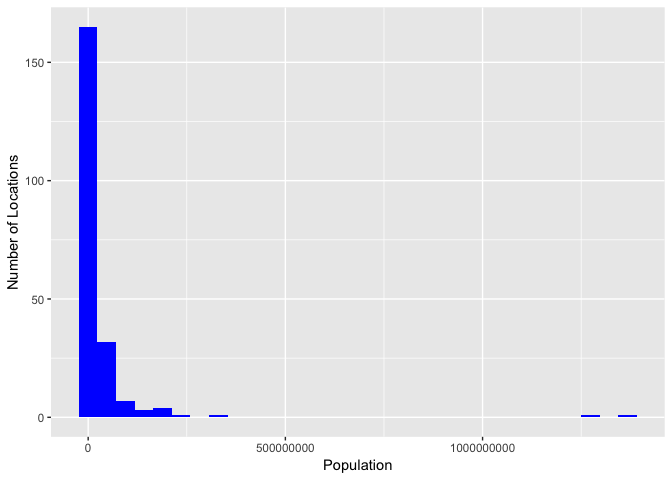
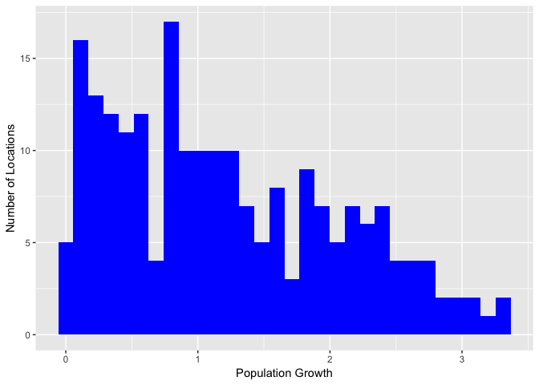
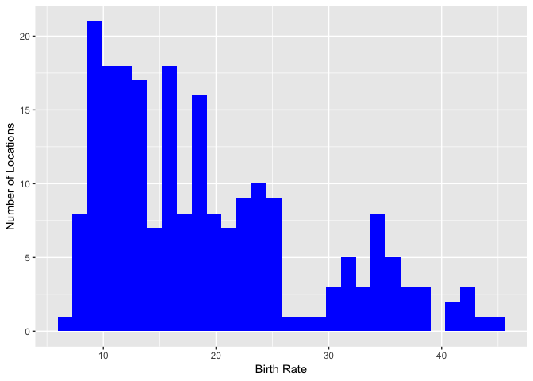
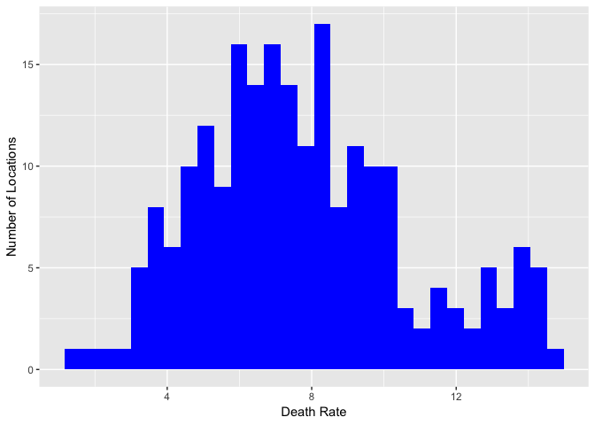

### Introduction

Often times, SQL is used as a stand-alone tool, but databases can be imported into R to harness the power of its visualization and efficiency with the ```tidyverse```.  Now we can take advantage of ```ggplot2```, ```stringr```, and ```lubridate```, as well as the SQL-like syntax of ```dplyr```.  More advanced queries are actually easier with ```dplyr```.  

On account of these advantages, this analysis entails importing a SQLite database and converting it to an R table for querying and analysis.  The data comes from the CIA World Factbook, a compendium of statistics about all of the countries on Earth. The Factbook contains demographic information like:

* ```population``` - The population as of ```2015```
* ```population_growth``` - The annual population growth, as a percentage
* ```area``` - The total land and water area.

The data can be found from this [Github repo](https://github.com/factbook/factbook.sql/releases)

### Getting Started:


```r
library(RSQLite)
library(tidyr)
library(dplyr)
library(dbplyr)
library(ggplot2)
library(magrittr)
library(purrr)
library(stringr)
```


```r
working_dir<- "/Users/roberthazell/Desktop/Dataquest/CIA-Factbook"
setwd(working_dir)
```

Link the database once it's downloaded to a working directory.


```r
working_dir<- "/Users/roberthazell/Desktop/Dataquest/CIA-Factbook"
setwd(working_dir)
con <- DBI::dbConnect(RSQLite::SQLite(), dbname = paste(c(working_dir, "/factbook.db"), collapse = ''))
```

See the tables in ```con```.  The relevant table is ```facts```.


```r
dbListTables(con)
```

```
[1] "facts"           "sqlite_sequence"
```

Now we can save this table to it's own variable ```cia_db```.


```r
# use tbl (required) to convert to tabular format
# then convert to data frame
cia_db <- tbl(con, "facts") %>% as.data.frame()
```

Here's the first 5 rows, to show it works:


```r
head(cia_db, 5)
```

```
  id code        name    area area_land area_water population
1  1   af Afghanistan  652230    652230          0   32564342
2  2   al     Albania   28748     27398       1350    3029278
3  3   ag     Algeria 2381741   2381741          0   39542166
4  4   an     Andorra     468       468          0      85580
5  5   ao      Angola 1246700   1246700          0   19625353
  population_growth birth_rate death_rate migration_rate
1              2.32      38.57      13.89           1.51
2              0.30      12.92       6.58           3.30
3              1.84      23.67       4.31           0.92
4              0.12       8.13       6.96           0.00
5              2.78      38.78      11.49           0.46
                  created_at                 updated_at
1 2015-11-01 13:19:49.461734 2015-11-01 13:19:49.461734
2 2015-11-01 13:19:54.431082 2015-11-01 13:19:54.431082
3 2015-11-01 13:19:59.961286 2015-11-01 13:19:59.961286
4 2015-11-01 13:20:03.659945 2015-11-01 13:20:03.659945
5 2015-11-01 13:20:08.625072 2015-11-01 13:20:08.625072
```

Taking a look at the structure:


```r
str(cia_db)
```

```
'data.frame':	261 obs. of  13 variables:
 $ id               : int  1 2 3 4 5 6 7 8 9 10 ...
 $ code             : chr  "af" "al" "ag" "an" ...
 $ name             : chr  "Afghanistan" "Albania" "Algeria" "Andorra" ...
 $ area             : int  652230 28748 2381741 468 1246700 442 2780400 29743 7741220 83871 ...
 $ area_land        : int  652230 27398 2381741 468 1246700 442 2736690 28203 7682300 82445 ...
 $ area_water       : int  0 1350 0 0 0 0 43710 1540 58920 1426 ...
 $ population       :integer64 32564342 3029278 39542166 85580 19625353 92436 43431886 3056382 ... 
 $ population_growth: num  2.32 0.3 1.84 0.12 2.78 1.24 0.93 0.15 1.07 0.55 ...
 $ birth_rate       : num  38.57 12.92 23.67 8.13 38.78 ...
 $ death_rate       : num  13.89 6.58 4.31 6.96 11.49 ...
 $ migration_rate   : num  1.51 3.3 0.92 0 0.46 2.21 0 5.8 5.65 5.56 ...
 $ created_at       : chr  "2015-11-01 13:19:49.461734" "2015-11-01 13:19:54.431082" "2015-11-01 13:19:59.961286" "2015-11-01 13:20:03.659945" ...
 $ updated_at       : chr  "2015-11-01 13:19:49.461734" "2015-11-01 13:19:54.431082" "2015-11-01 13:19:59.961286" "2015-11-01 13:20:03.659945" ...
```

The ```population``` column is of type integer64, which will cause problems when plotting.  To remedy, this'll be converted to a numeric type.


```r
cia_db$population %<>% as.numeric(.)
class(cia_db$population)
```

```
[1] "numeric"
```

### Summary Statistics

Here's info on the minimum and maximum values each for population and population growth.


```r
cia_db %>% 
  select(population, population_growth) %>% 
  summarise('Min Population' = min(population),
            'Max Population' = max(population),
            'Min Population Growth' = min(population_growth),
            'Max Population Growth' = max(population_growth))
```

```
  Min Population Max Population Min Population Growth
1    -2147483648     7256490011                    NA
  Max Population Growth
1                    NA
```

Several curious features stand out.  There's a *negative* population value, and both the minimum and maximum population growth values are ```NA```.  This implies the presence of ```NA```s for the column ```population_growth```.  

Let's see where the negative population location(s) is(are).


```r
cia_db %>% 
  filter(population <= 0) %>% 
  select(name, population) %>%
  arrange(name)
```

```
                                            name  population
1                                     Antarctica           0
2                                   Arctic Ocean -2147483648
3                    Ashmore and Cartier Islands -2147483648
4                                 Atlantic Ocean -2147483648
5                                  Bouvet Island -2147483648
6                 British Indian Ocean Territory -2147483648
7                              Clipperton Island -2147483648
8                              Coral Sea Islands -2147483648
9            French Southern and Antarctic Lands -2147483648
10             Heard Island and McDonald Islands -2147483648
11                                  Indian Ocean -2147483648
12                                     Jan Mayen -2147483648
13                                Navassa Island -2147483648
14                                 Pacific Ocean -2147483648
15                               Paracel Islands -2147483648
16      South Georgia and South Sandwich Islands -2147483648
17                                Southern Ocean -2147483648
18                               Spratly Islands -2147483648
19 United States Pacific Island Wildlife Refuges -2147483648
20                                   Wake Island -2147483648
```

Notice the ```population``` of 0 for Antartica.

And now for the locations with missing ```population_growth```.


```r
cia_db %>% filter(is.na(population_growth)) %>% select(name)
```

```
                                            name
1                                         Kosovo
2                    Ashmore and Cartier Islands
3                              Coral Sea Islands
4              Heard Island and McDonald Islands
5                              Clipperton Island
6            French Southern and Antarctic Lands
7                               Saint Barthelemy
8                                   Saint Martin
9                                  Bouvet Island
10                                     Jan Mayen
11                                      Akrotiri
12                British Indian Ocean Territory
13                                      Dhekelia
14      South Georgia and South Sandwich Islands
15                                Navassa Island
16                                   Wake Island
17 United States Pacific Island Wildlife Refuges
18                                    Antarctica
19                               Paracel Islands
20                               Spratly Islands
21                                  Arctic Ocean
22                                Atlantic Ocean
23                                  Indian Ocean
24                                 Pacific Ocean
25                                Southern Ocean
```

Also, what's that place with 7,256,490,011 people?  


```r
cia_db %>% filter(population == max(population)) %>% select(name, population)
```

```
   name population
1 World 7256490011
```

### Histograms

Before visualizing some key variables, let's eliminate any rows with ```NA``` and non-positive or 0 ```population``` values.  Also, ```World``` will be removed.


```r
cia_db %<>% filter(!(population < 0 | population == max(population)),
                  complete.cases(.))
```

Now for the plots.


```r
# use results = 'hide' to remove consolt output ([[1]], etc)
# create function to plot each histogram and format x axis
plot_cia_var <- function(v) {
  ggplot(cia_db) + 
    geom_histogram(aes_string(v), fill = "blue") + 
    xlab(gsub("_", " ", v) %>% str_to_title()) +
    ylab("Number of Locations")
}

to_plot <- c("population", "population_growth", "birth_rate", "death_rate")
map(to_plot, plot_cia_var)
```

<!-- --><!-- --><!-- --><!-- -->

Several observations can be made:

* ```birth_rate``` is mostly between 10 and 20 children per 1000 globally

* ```death_rate``` is roughly symmetric at around 8 per 1000, though some locations are alarmingly higher.  We can see which locations have a death rate higer than 12 per 1000


```r
cia_db %>% filter(death_rate > 12) %>% select(name, death_rate)
```

```
                       name death_rate
1               Afghanistan      13.89
2                   Belarus      13.36
3                  Botswana      13.39
4                  Bulgaria      14.44
5  Central African Republic      13.80
6                   Croatia      12.18
7                   Estonia      12.40
8                     Gabon      13.12
9             Guinea-Bissau      14.33
10                  Hungary      12.73
11                   Latvia      14.31
12                  Lesotho      14.89
13                Lithuania      14.27
14                     Mali      12.89
15                  Moldova      12.59
16               Mozambique      12.10
17                  Namibia      13.91
18                  Nigeria      12.90
19                   Russia      13.69
20                   Serbia      13.66
21                  Somalia      13.62
22                Swaziland      13.56
23                  Ukraine      14.46
24                   Zambia      12.67
```

Many of these countries are in Africa or Eastern Europe.

* ```population_growth``` is roughly between 0-150%, but a strong minority of countries are growing even faster

### Exploring Population Density

Population density is the ratio of population to land area.  We can compute this for each country and compare those results with [Wikipedia's](https://simple.wikipedia.org/wiki/List_of_countries_by_population_density).


```r
cia_db %>% 
  mutate(`Population Density` = population/area_land) %>% 
  arrange(desc(`Population Density`)) %>% 
  select(name, `Population Density`) %>%
  head(10)
```

```
         name Population Density
1       Macau          21168.964
2      Monaco          15267.500
3   Singapore           8259.785
4   Hong Kong           6655.271
5  Gaza Strip           5191.819
6   Gibraltar           4876.333
7     Bahrain           1771.859
8    Maldives           1319.641
9       Malta           1310.016
10    Bermuda           1299.926
```

This accords moderately well with the info from Wikipedia.  Have a look.


### Conclusion

This project examined some of the core variables of the CIA Factbook dataset, after cleaning data inconsistencies.  It demonstrates the elegance of ```dplyr``` syntax and it's semblance to SQL, as well as how to integrate databases into R/RStudio.


